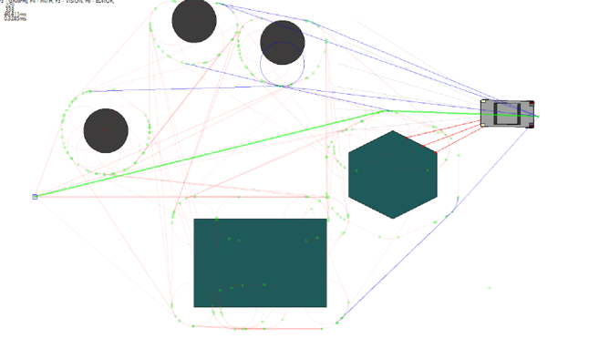

# AStar

 

 App, that models behavior of auto-pilot car.

## Features
 - Building graph for avoidinig obstacles without using the grid
 - Searching shortest path by A* algorithm
 - Generating signals (such as acceleration, braking or turning) for car to follow path
 - Building map of objects by using information from distance sensor \[WIP\]
